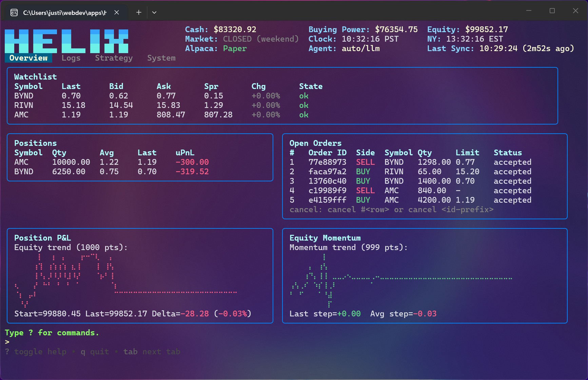

# helix-tui

`helix-tui` is a Go CLI + TUI trading cockpit for Alpaca with:

- risk-gated order execution
- autonomous execution agents (`heuristic` and `llm`)
- low-frequency strategy analyst overseer
- SQLite-backed persistence (events, equity history, strategy memory)



## Disclaimer

This project is an AI-generated, experimental toy project for educational/development use only.
It is not investment advice and is not production-ready trading software.
You are solely responsible for all configuration, operation, compliance, and losses.
Use at your own risk.

## Documentation

- [Architecture](./docs/architecture.md)
- [New user onboarding](./docs/onboarding.md)
- [Operator playbook](./docs/operator-playbook.md)
- [Implementation roadmap](./docs/implementation-plan.md)
- [Config template](./config.example.toml)

## Runtime Model (Important)

- Runtime broker is Alpaca.
- Select environment via `[alpaca].env = "paper" | "live"`.
- The in-memory `paper` broker adapter exists for tests only.

## Prerequisites

- Go 1.24+
- Alpaca account/API keys (paper recommended)
- Optional: OpenAI API key for `[agent].type = "llm"` and strategy analyst

## Quick Start

1. Create your config:

```powershell
Copy-Item config.example.toml config.toml
```

If `config.toml` is missing, startup will prompt you to create it automatically from `config.example.toml`.

1. Keep safe defaults while validating:

- `[alpaca].env = "paper"`
- `mode = "manual"` or `mode = "assist"`
- if using `mode = "auto"`, set `[agent].dry_run = true` first

1. Run with TUI:

```bash
go run ./cmd/helix -config=config.toml
```

1. Optional headless mode:

```bash
go run ./cmd/helix -config=config.toml -headless
```

1. Print version:

```bash
go run ./cmd/helix -version
```

## Configuration

Config source precedence:

1. built-in defaults
1. `config.toml`
1. env vars (`APCA_API_KEY_ID`, `APCA_API_SECRET_KEY`, `APCA_API_DATA_URL`, `OPENAI_API_KEY`)
1. CLI flags (`-config`, `-headless`, `-version`)

Key config areas:

- `mode`: `manual | assist | auto`
- `[identity]`: `human_name`, `human_alias`, `agent_name`
- `[alpaca]`: env/endpoints/feed + credentials (or env/keyring)
- `[risk]`: max trade/day notional
- `[compliance]`: PDT/GFV guardrails
- `[agent]`: runtime cadence + intent limits + low power
- `[agent.heuristic]`: heuristic-only sizing/trigger settings
- `[agent.llm]`: model/prompt/timeout/context logging
- `[strategy]` and `[strategy.llm]`: overseer cadence + model/prompt
- `[logging]`: structured log file/mode/level
- `[database]`: SQLite state path

## Credentials

You can provide credentials via:

- environment variables
- `config.toml`
- OS keyring (`[keyring].use = true`)

Recommended: enable keyring and avoid keeping secrets in `config.toml`.

## Runtime Modes

- `manual`: no autonomous order execution
- `assist`: agent proposes intents, operator approves manually
- `auto`: agent executes via the same risk/compliance path as manual commands

Safe progression:

1. `manual` + watch behavior
1. `assist`
1. `auto` with `[agent].dry_run = true`
1. `auto` with dry-run disabled only after validation

## TUI Commands

- `buy <SYM> <QTY>`
- `sell <SYM> <QTY>`
- `cancel <ORDER_ID|ORDER_ID_PREFIX|#ROW>`
- `flatten`
- `sync`
- `watch list|add <SYM>|remove <SYM>|sync`
- `events up|down|top|tail [N]`
- `strategy run|status|approve <ID>|reject <ID>|archive <ID>`
- `tab overview|logs|strategy|system`
- `q`
- `?` toggle help

## Safety/Execution Notes

- Watchlist is the effective trading allowlist.
- LLM output only proposes intents; engine risk/compliance gates still decide execution.
- Compliance gate can reject orders (e.g., PDT/GFV protections) with explicit rejection reasons.
- Strategy mode can constrain autonomous execution to active plan recommendations.
- Low-power mode reduces autonomous activity outside market hours.

## Development

Run checks before committing:

```bash
go test ./...
go build ./cmd/helix
go run golang.org/x/vuln/cmd/govulncheck@latest ./...
```
