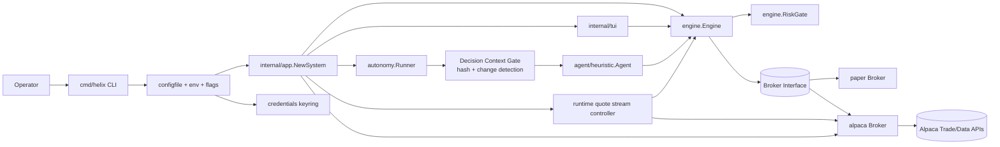
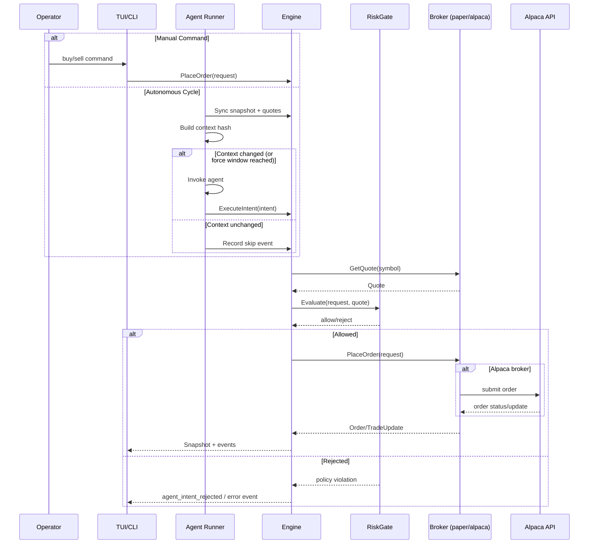
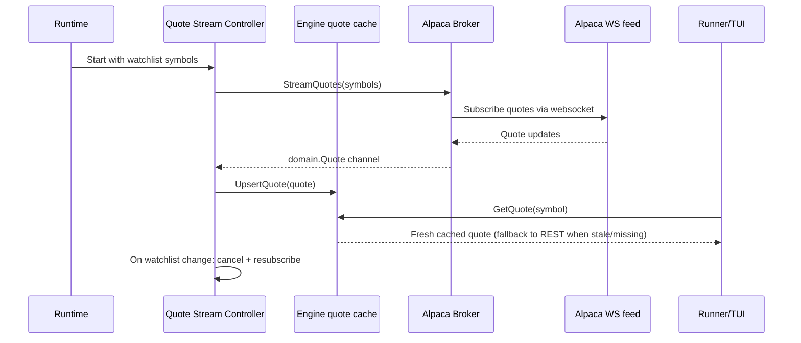
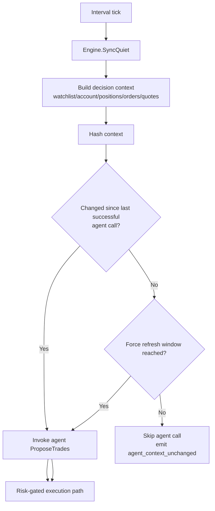

# Architecture

## Component Diagram



## Order Data Flow (Manual and Autonomous)



## Quote Data Flow



## Autonomous Decision Loop



## Watchlist Flow

```mermaid
flowchart TD
    START[Startup]
    LOADCFG[Load config + flags + env]
    PULLALPACA[If broker=alpaca:<br/>pull watchlist from Alpaca API]
    LOCALWATCH[If broker=paper:<br/>use local watchlist from config/flags]
    ALLOW[Add watchlist symbols to risk allowlist]
    RUN[Run TUI/agent]

    START --> LOADCFG --> PULLALPACA --> ALLOW --> RUN
    START --> LOADCFG --> LOCALWATCH --> ALLOW --> RUN

    RUN -->|watch add/remove (alpaca)| PUSH[Push to Alpaca watchlist API]
    RUN -->|watch sync/pull (alpaca)| PULL[Pull remote Alpaca watchlist]
```
