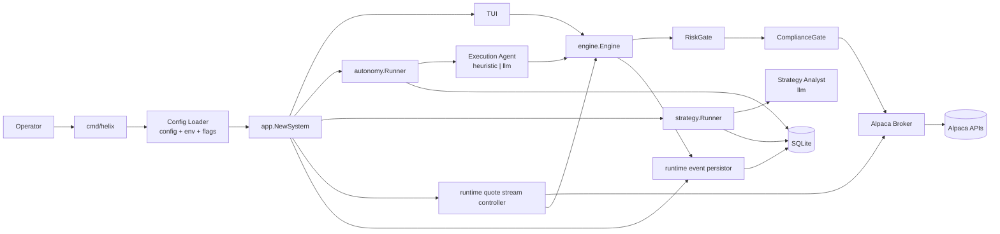
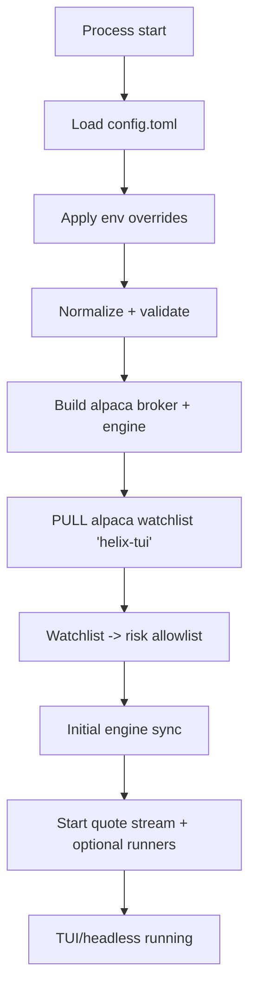
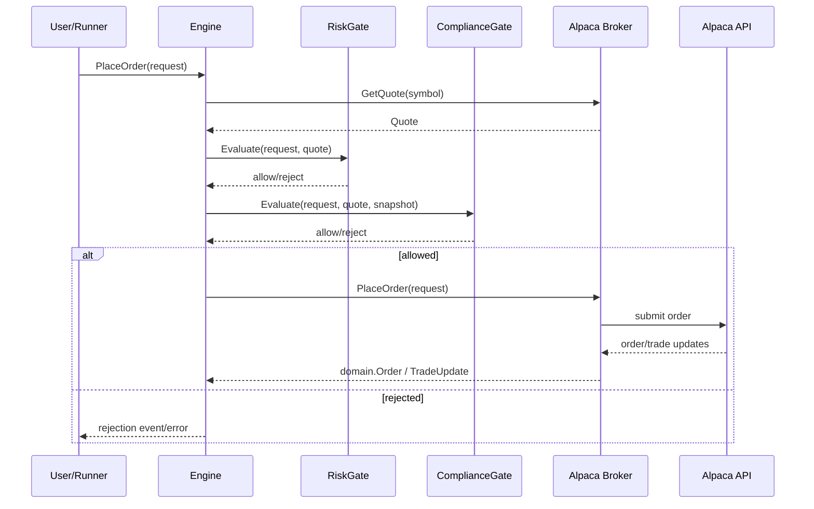
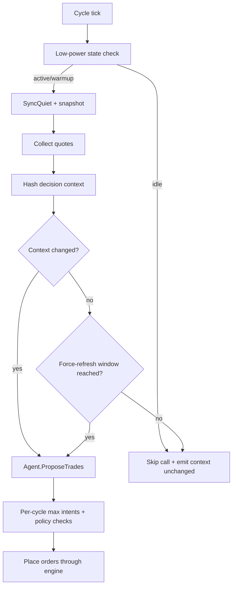
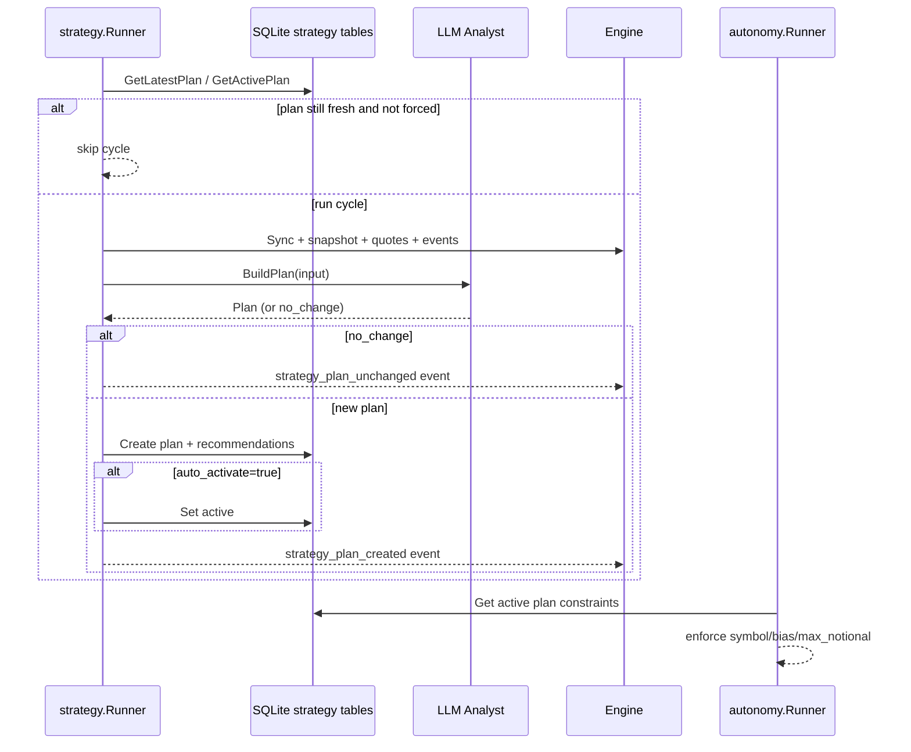
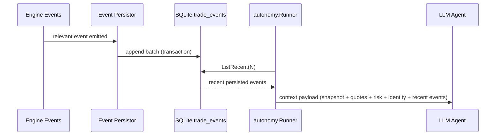
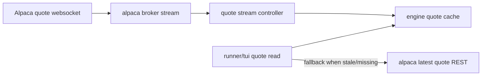

# Architecture

This document describes the current runtime architecture of `helix-tui`.

## Runtime Scope

- Runtime broker path: Alpaca (`[alpaca].env = paper|live`)
- Config-first runtime (`config.toml` + env overrides + minimal flags)
- Safety pipeline: `RiskGate` -> `ComplianceGate` -> broker execution
- Autonomous execution optionally constrained by active strategy plan

`internal/broker/paper` remains in the codebase for deterministic tests.

## High-Level Components

## Startup/Data Initialization

## Order Execution Pipeline (Manual + Auto)

## Autonomous Decision Loop

## Strategy Analyst Loop

## Event Persistence + LLM Context

## Quote Streaming

## Safety Boundaries

- Watchlist is the effective execution allowlist.
- All order paths (manual/TUI/autonomous) go through the same engine gates.
- Compliance checks run after risk checks before broker submission.
- Autonomous execution can be globally dampened by low-power mode.
- Strategy policy can further restrict autonomous execution decisions.

## Compliance Reconciliation

- On every engine sync, compliance posture is reconciled against broker account state.
- Engine emits:
  - `compliance_posture` when posture changes (account type, PDT flags/counters, guard settings, unsettled estimates).
  - `compliance_drift_detected` / `compliance_drift_cleared` when local unsettled-proceeds estimates diverge from broker-implied unsettled funds.
- System tab surfaces posture and drift summaries for operators.
- Autonomous agent context now includes a structured `compliance` section, so LLM decisions can account for broker-reported PDT state and drift.
